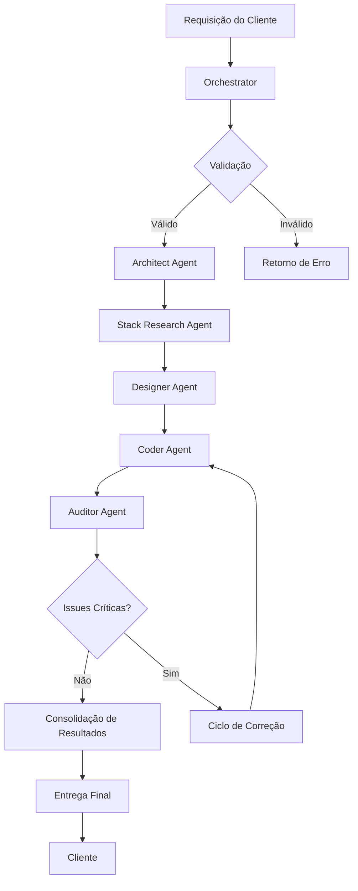
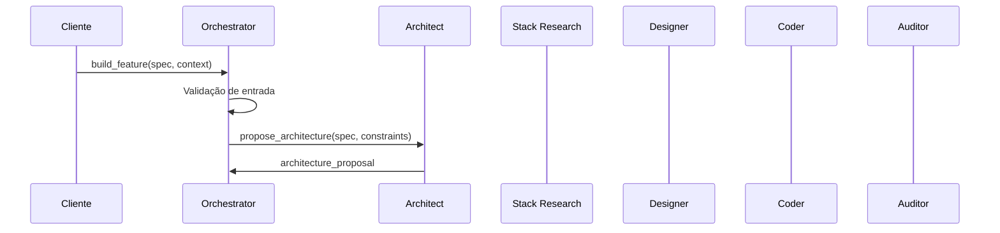
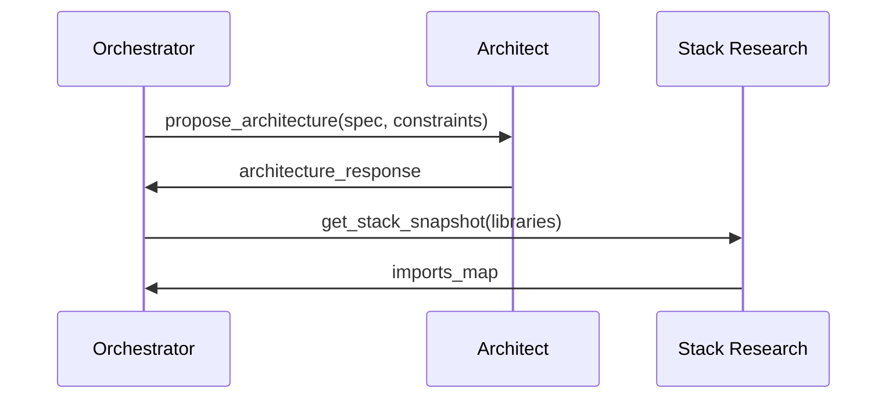
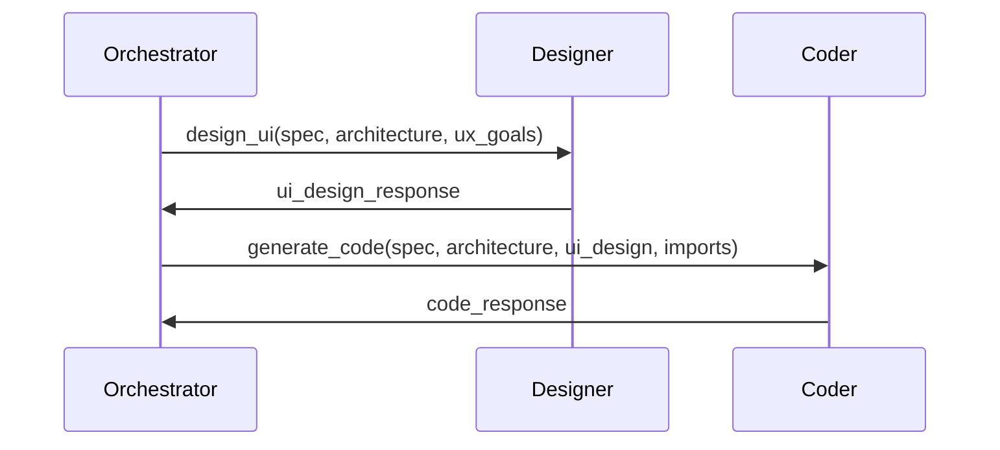
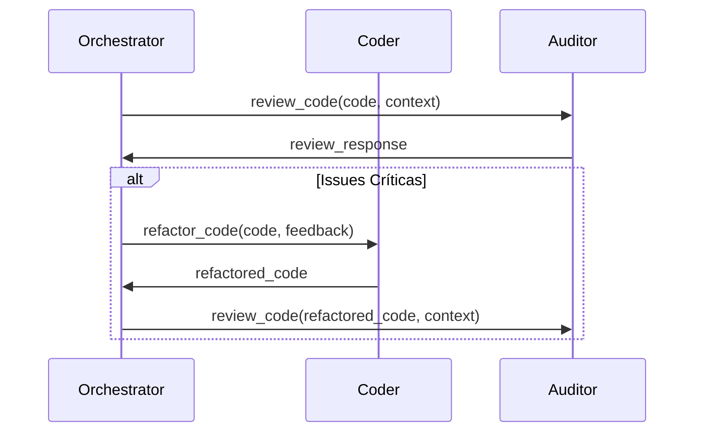
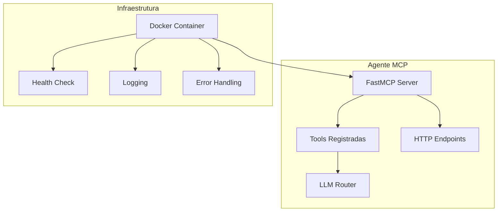
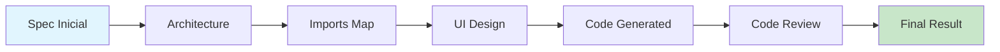
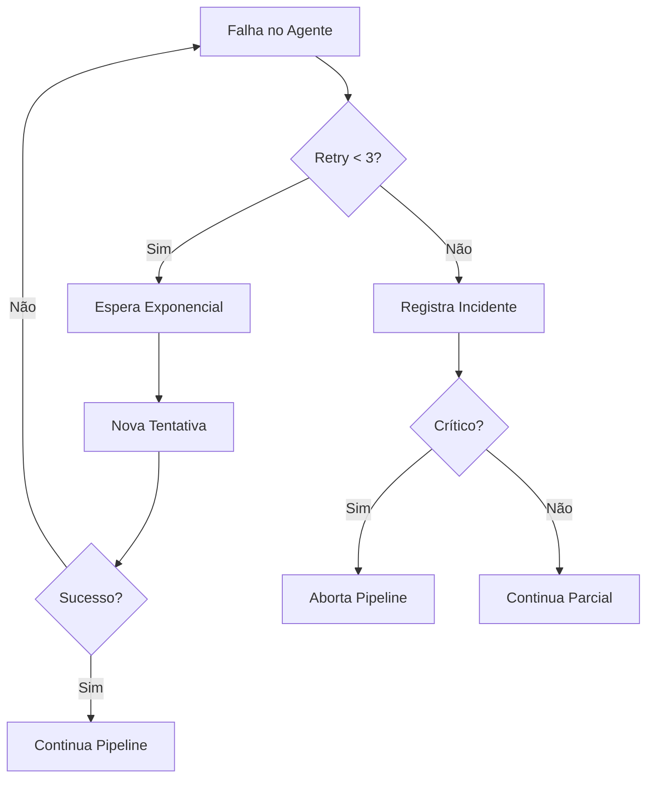
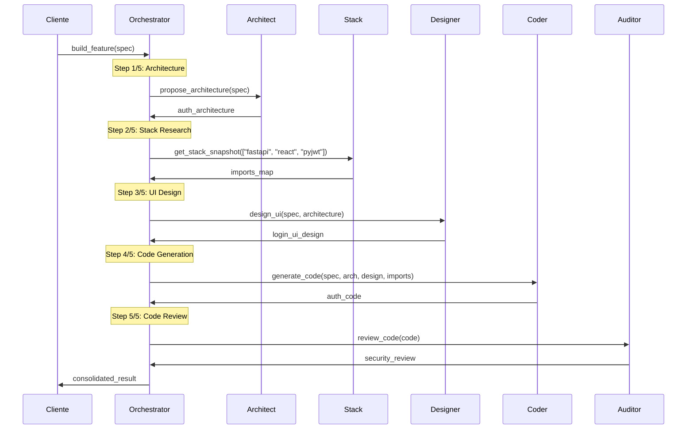
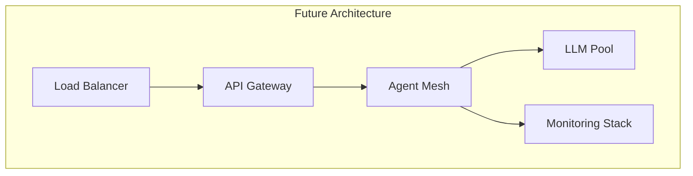

# 🤖 Como Funcionam os Agentes - Sistema Multi-Agente Blue AI

## 📋 Visão Geral

O Sistema Multi-Agente Blue AI é uma arquitetura distribuída baseada no **Model Context Protocol (MCP)** que implementa agentes especializados para diferentes fases do ciclo de desenvolvimento de software. Cada agente possui responsabilidades específicas e trabalha de forma coordenada sob o comando do **Orchestrator Agent**.

## 🏗️ Arquitetura do Sistema

```
┌─────────────────────────────────────────────────────────────────┐
│                    IDE/Client (stdio MCP)                        │
│                    (Claude/Cursor/VS Code)                       │
└────────────────────────────┬────────────────────────────────────┘
                              │ stdio
                              ▼
┌─────────────────────────────────────────────────────────────────┐
│              BLUE ORCHESTRATOR (Container)                       │
│                                                                  │
│  ┌──────────────────────────────────────────────────────────┐  │
│  │              LLM Router (GLM-4.6)                       │  │
│  └──────────────────────────────────────────────────────────┘  │
│                                                                  │
│  ┌──────────────────────────────────────────────────────────┐  │
│  │           MCP Client (HttpTransport)                     │  │
│  └──────────────────────────────────────────────────────────┘  │
└────────────────────────────┬────────────────────────────────────┘
                              │ HTTP/MCP
           ┌──────────────────┼──────────────────┬─────────────────┐
           │                  │                  │                 │
           ▼                  ▼                  ▼                 ▼
┌──────────────────┐ ┌──────────────┐ ┌──────────────┐ ┌─────────────────┐
│ Architect Agent  │ │ Designer/UIX │ │ Coder Agent  │ │ Auditor Agent   │
│  (MCP Server)    │ │ Agent (MCP)  │ │  (MCP Server)│ │  (MCP Server)   │
└──────────────────┘ └──────────────┘ └──────────────┘ └─────────────────┘
           │                  │                  │                 │
           └──────────────────┴──────────────────┴─────────────────┘
                                    │
                                    ▼
                       ┌─────────────────────────┐
                       │StackResearch Agent (MCP)│
                       │        GLM-4.6          │
                       └─────────────────────────┘
```

## 🧠 Componentes Principais

### 1. Orchestrator Agent (Porta 9080)
**Função**: Maestro do sistema, coordena todos os outros agentes
- **Responsabilidades**:
  - Receber requisições do cliente via stdio MCP
  - Orquestrar o pipeline completo de desenvolvimento
  - Gerenciar comunicação entre agentes via HTTP
  - Consolidar resultados e métricas

- **Tools Principais**:
  - `build_feature()`: Pipeline completo de desenvolvimento
  - `quick_code()`: Geração rápida de código
  - `research_stack()`: Pesquisa de bibliotecas

### 2. Architect Agent (Porta 9081)
**Função**: Design de arquitetura de sistemas
- **Responsabilidades**:
  - Propor arquitetura backend/frontend
  - Definir módulos, APIs, models e services
  - Identificar pontos de integração
  - Analisar trade-offs arquiteturais

- **Tools Principais**:
  - `propose_architecture()`: Cria arquitetura completa
  - `refine_architecture()`: Refina arquitetura baseada em feedback

### 3. Designer/UIX Agent (Porta 9082)
**Função**: Design de interfaces e experiência do usuário
- **Responsabilidades**:
  - Criar design systems e tokens
  - Definir layouts e componentes
  - Garantir acessibilidade e responsividade
  - Gerar componentes React/TypeScript

- **Tools Principais**:
  - `design_ui()`: Design completo de interface
  - `generate_component()`: Gera componentes específicos
  - `create_design_system()`: Cria sistema de design

### 4. Coder Agent (Porta 9083)
**Função**: Geração de código limpo e testes
- **Responsabilidades**:
  - Implementar código backend (FastAPI) e frontend (React)
  - Gerar testes unitários e de integração
  - Refatorar código existente
  - Seguir best practices de programação

- **Tools Principais**:
  - `generate_code()`: Gera código completo
  - `refactor_code()`: Refatora código existente
  - `generate_tests()`: Cria testes automatizados

### 5. Auditor Agent (Porta 9084)
**Função**: Revisão de código e segurança
- **Responsabilidades**:
  - Análise de qualidade de código
  - Scan de vulnerabilidades de segurança
  - Validação de imports e dependências
  - Identificar code smells e anti-padrões

- **Tools Principais**:
  - `review_code()`: Revisão completa de código
  - `security_scan()`: Análise de segurança OWASP
  - `validate_imports()`: Validação de dependências

### 6. StackResearch Agent (Porta 9085)
**Função**: Pesquisa de tecnologias e dependências
- **Responsabilidades**:
  - Pesquisar versões atualizadas de bibliotecas
  - Identificar imports corretos
  - Verificar compatibilidade entre dependências
  - Documentar APIs depreciadas

- **Tools Principais**:
  - `get_imports()`: Pesquisa imports de bibliotecas
  - `get_stack_snapshot()`: Snapshot de múltiplas bibliotecas
  - `search_best_practice()`: Busca melhores práticas

## 🔄 Fluxo de Trabalho (Pipeline)

### Fluxograma do Pipeline Principal



### Pipeline Detalhado

#### 1. Fase de Inicialização


#### 2. Fase de Arquitetura e Stack


#### 3. Fase de Design e Implementação


#### 4. Fase de Auditoria e Correção


## 🚀 Como os Agentes se Comunicam

### Protocolo de Comunicação

1. **Cliente ↔ Orchestrator**: MCP via stdio (para IDEs)
2. **Orchestrator ↔ Agentes**: MCP via HTTP (interno)
3. **Agentes ↔ LLM**: HTTP API (OpenRouter/GLM-4.6)

### Formato de Mensagens

```json
{
  "jsonrpc": "2.0",
  "id": "unique_id",
  "method": "tools/call",
  "params": {
    "name": "nome_da_ferramenta",
    "arguments": {
      "param1": "valor1",
      "param2": "valor2"
    }
  }
}
```

### Endpoints HTTP dos Agentes

| Agente | Porta | Endpoints Principais |
|--------|-------|---------------------|
| Orchestrator | 9080 | `/mcp`, `/health`, `/mcp/tools/call` |
| Architect | 9081 | `/mcp`, `/health`, `/mcp/tools/call` |
| Designer | 9082 | `/mcp`, `/health`, `/mcp/tools/call` |
| Coder | 9083 | `/mcp`, `/health`, `/mcp/tools/call` |
| Auditor | 9084 | `/mcp`, `/health`, `/mcp/tools/call` |
| Stack Research | 9085 | `/mcp`, `/health`, `/mcp/tools/call` |

## 🧩 Estrutura Interna dos Agentes

### Componentes Comuns



### Estrutura de Código dos Agentes

```python
# Estrutura padrão de todos os agentes
import json
from typing import Any, Dict, List
from starlette.applications import Starlette
from mcp.server.fastmcp import FastMCP
from llm_router import LLMRouter, Message

# Inicialização
mcp = FastMCP("NomeDoAgente")
router = LLMRouter()

@mcp.tool()
async def tool_principal(param1: str, param2: dict) -> dict:
    """Implementação da ferramenta principal"""
    # Lógica específica do agente
    result = await router.call_glm46(messages)
    return result

# Configuração HTTP
app = mcp.streamable_http_app()
app.add_route("/health", health_endpoint, methods=["GET"])
app.add_route("/mcp/tools/call", call_tool_endpoint, methods=["POST"])
```

## 📊 Gerenciamento de Estado e Contexto

### Fluxo de Dados entre Agentes



### Estrutura de Dados Compartilhados

```typescript
interface PipelineContext {
  spec: string;                    // Especificação original
  architecture: ArchitectureSpec;  // Saída do Architect
  imports: ImportMap;              // Saída do Stack Research
  ui_design: UIDesignSpec;         // Saída do Designer
  code: CodeSpec;                  // Saída do Coder
  review: ReviewSpec;              // Saída do Auditor
  metrics: PipelineMetrics;        // Métricas de execução
}
```

## 🛡️ Mecanismos de Segurança

### 1. Isolamento de Rede
- Agentes executam em containers Docker isolados
- Comunicação interna via network Docker dedicada
- Sem exposição direta à internet

### 2. Validação de Entrada
- Todos os agentes validam parâmetros de entrada
- Sanitização de código malicioso
- Mascaramento de dados sensíveis

### 3. Gestão de Segredos
- API keys armazenadas em variáveis de ambiente
- Nunca expostas em logs ou respostas
- Rotação automática de chaves

## 📈 Monitoramento e Observabilidade

### Health Checks
```yaml
# Configuração no docker-compose.yml
healthcheck:
  test: ["CMD", "curl", "-f", "http://localhost:8080/health"]
  interval: 30s
  timeout: 5s
  retries: 3
```

### Métricas Coletadas
- Tempo de resposta por agente
- Taxa de sucesso das ferramentas
- Número de retries por chamada
- Consumo de tokens dos LLMs
- Status de saúde dos containers

### Estrutura de Logs
```json
{
  "timestamp": "2025-01-01T00:00:00Z",
  "agent": "orchestrator",
  "level": "INFO",
  "message": "Pipeline step completed",
  "metadata": {
    "step": "architecture",
    "duration_ms": 1500,
    "success": true
  }
}
```

## 🔄 Tratamento de Erros e Recuperação

### Estratégia de Retry
```python
@_retry_on_failure(max_attempts=3)
async def call_agent_with_retry(agent_url, tool_name, arguments):
    """Implementação com retry exponencial"""
    # Tentativa 1: imediata
    # Tentativa 2: após 2s
    # Tentativa 3: após 4s
```

### Fluxo de Recuperação



## 🚀 Exemplo Prático: Implementação de Autenticação

### 1. Requisição Inicial
```bash
# Cliente envia para o Orchestrator
build_feature(
  spec="Sistema de autenticação com JWT e 2FA",
  context="React frontend, FastAPI backend"
)
```

### 2. Pipeline em Execução



### 3. Resultado Final
```json
{
  "architecture": {
    "backend": {
      "modules": ["auth", "users", "tokens"],
      "apis": ["/login", "/register", "/verify-2fa"],
      "services": ["AuthService", "TokenService"]
    },
    "frontend": {
      "components": ["LoginForm", "TwoFactorForm"],
      "routes": ["/login", "/dashboard"]
    }
  },
  "imports": {
    "fastapi": "0.104.1",
    "pyjwt": "2.8.0",
    "react": "18.2.0"
  },
  "ui_design": {
    "screens": ["login", "2fa-verification"],
    "design_tokens": {...}
  },
  "code": {
    "backend": {"files": [...]},
    "frontend": {"files": [...]}
  },
  "review": {
    "issues": [],
    "security_score": 9.5,
    "status": "approved"
  },
  "status": "success"
}
```

## 🔧 Configuração e Deploy

### Docker Compose
```yaml
# Cada agente como serviço independente
services:
  orchestrator:
    build: docker/Dockerfile.orchestrator
    ports: ["9080:8080"]
    environment:
      - OPENROUTER_API_KEY=${OPENROUTER_API_KEY}
  
  architect-agent:
    build: docker/Dockerfile.architect
    ports: ["9081:8080"]
    deploy:
      resources:
        limits:
          memory: 512M
```

### Configuração MCP para IDEs
```json
// Claude Desktop
{
  "mcpServers": {
    "blue-orchestrator": {
      "command": "docker",
      "args": ["run", "-i", "--rm", "blue-orchestrator"],
      "env": {
        "OPENROUTER_API_KEY": "your_key_here"
      }
    }
  }
}
```

## 📚 Melhores Práticas

### 1. Para Desenvolvedores
- Manter agents stateless
- Implementar timeouts adequados
- Usar structured logging
- Validar rigorosamente entradas

### 2. Para Operações
- Monitorar health checks
- Configurar alertas automáticos
- Manter backups de configuração
- Documentar incidentes

### 3. Para Usuários
- Fornecer specs detalhadas
- Incluir contexto relevante
- Revisar outputs cuidadosamente
- Reportar anomalias

## 🔮 Evolução Futura

### Roadmap Planejado
1. **Expansão de Agentes**: Database, DevOps, QA
2. **Melhorias de LLM**: Integração com modelos mais recentes
3. **Interface Web**: Dashboard de monitoramento
4. **Autoscaling**: Escalonamento dinâmico baseado em carga
5. **Multi-tenant**: Isolamento entre projetos

### Arquitetura Alvo


---

## 📖 Conclusão

O Sistema Multi-Agente Blue AI representa uma abordagem moderna e escalável para desenvolvimento de software, combinando:

- **Especialização**: Cada agente foca em sua área de expertise
- **Orquestração**: Coordenação inteligente via Orchestrator
- **Padronização**: Protocolo MCP para comunicação consistente
- **Observabilidade**: Monitoramento completo e métricas detalhadas
- **Recuperação**: Robustez com retries e fallbacks

Esta arquitetura permite transformar requisitos de negócio em código production-ready de forma automatizada, auditável e escalável.