# 🤖 How the Agents Work - Blue AI Multi-Agent System

## 📋 Overview

The Blue AI Multi-Agent System is a distributed architecture based on the **Model Context Protocol (MCP)** that implements specialized agents for different phases of the software development lifecycle. Each agent has specific responsibilities and works in a coordinated manner under the command of the **Orchestrator Agent**.

## 🏗️ System Architecture

```
┌─────────────────────────────────────────────────────────────────┐
│                    IDE/Client (stdio MCP)                        │
│                    (Claude/Cursor/VS Code)                       │
└────────────────────────────┬────────────────────────────────────┘
                              │ stdio
                              ▼
┌─────────────────────────────────────────────────────────────────┐
│              BLUE ORCHESTRATOR (Container)                       │
│                                                                  │
│  ┌──────────────────────────────────────────────────────────┐  │
│  │              LLM Router (GLM-4.6)                       │  │
│  └──────────────────────────────────────────────────────────┘  │
│                                                                  │
│  ┌──────────────────────────────────────────────────────────┐  │
│  │           MCP Client (HttpTransport)                     │  │
│  └──────────────────────────────────────────────────────────┘  │
└────────────────────────────┬────────────────────────────────────┘
                              │ HTTP/MCP
           ┌──────────────────┼──────────────────┬─────────────────┐
           │                  │                  │                 │
           ▼                  ▼                  ▼                 ▼
┌──────────────────┐ ┌──────────────┐ ┌──────────────┐ ┌─────────────────┐
│ Architect Agent  │ │ Designer/UIX │ │ Coder Agent  │ │ Auditor Agent   │
│  (MCP Server)    │ │ Agent (MCP)  │ │  (MCP Server)│ │  (MCP Server)   │
└──────────────────┘ └──────────────┘ └──────────────┘ └─────────────────┘
           │                  │                  │                 │
           └──────────────────┴──────────────────┴─────────────────┘
                                    │
                                    ▼
                       ┌─────────────────────────┐
                       │StackResearch Agent (MCP)│
                       │        GLM-4.6          │
                       └─────────────────────────┘
```

## 🧠 Core Components

### 1. Orchestrator Agent (Port 9080)
**Function**: System maestro, coordinates all other agents
- **Responsibilities**:
  - Receive requests from the client via stdio MCP
  - Orchestrate the complete development pipeline
  - Manage inter-agent communication via HTTP
  - Consolidate results and metrics

- **Main Tools**:
  - `build_feature()`: Full development pipeline
  - `quick_code()`: Quick code generation
  - `research_stack()`: Library research

### 2. Architect Agent (Port 9081)
**Function**: System architecture design
- **Responsibilities**:
  - Propose backend/frontend architecture
  - Define modules, APIs, models, and services
  - Identify integration points
  - Analyze architectural trade-offs

- **Main Tools**:
  - `propose_architecture()`: Creates a complete architecture
  - `refine_architecture()`: Refines architecture based on feedback

### 3. Designer/UIX Agent (Port 9082)
**Function**: User interface and user experience design
- **Responsibilities**:
  - Create design systems and tokens
  - Define layouts and components
  - Ensure accessibility and responsiveness
  - Generate React/TypeScript components

- **Main Tools**:
  - `design_ui()`: Complete interface design
  - `generate_component()`: Generates specific components
  - `create_design_system()`: Creates a design system

### 4. Coder Agent (Port 9083)
**Function**: Clean code and test generation
- **Responsibilities**:
  - Implement backend (FastAPI) and frontend (React) code
  - Generate unit and integration tests
  - Refactor existing code
  - Follow programming best practices

- **Main Tools**:
  - `generate_code()`: Generates complete code
  - `refactor_code()`: Refactors existing code
  - `generate_tests()`: Creates automated tests

### 5. Auditor Agent (Port 9084)
**Function**: Code review and security
- **Responsibilities**:
  - Code quality analysis
  - Security vulnerability scanning
  - Validation of imports and dependencies
  - Identify code smells and anti-patterns

- **Main Tools**:
  - `review_code()`: Complete code review
  - `security_scan()`: OWASP security analysis
  - `validate_imports()`: Dependency validation

### 6. StackResearch Agent (Port 9085)
**Function**: Research of technologies and dependencies
- **Responsibilities**:
  - Research updated library versions
  - Identify correct imports
  - Check compatibility between dependencies
  - Document deprecated APIs

- **Main Tools**:
  - `get_imports()`: Researches library imports
  - `get_stack_snapshot()`: Snapshot of multiple libraries
  - `search_best_practice()`: Searches for best practices

## 🔄 Workflow (Pipeline)

### Main Pipeline Flowchart

```mermaid
graph TD
    A[Requisição do Cliente] --> B[Orchestrator]
    B --> C{Validação}
    C -->|Válido| D[Architect Agent]
    C -->|Inválido| E[Retorno de Erro]
    
    D --> F[Stack Research Agent]
    F --> G[Designer Agent]
    G --> H[Coder Agent]
    H --> I[Auditor Agent]
    
    I --> J{Issues Críticas?}
    J -->|Não| K[Consolidação de Resultados]
    J -->|Sim| L[Ciclo de Correção]
    
    L --> H
    K --> M[Entrega Final]
    M --> N[Cliente]
```



### Detailed Pipeline

#### 1. Initialization Phase

```mermaid
sequenceDiagram
    participant C as Cliente
    participant O as Orchestrator
    participant A as Architect
    participant S as Stack Research
    participant D as Designer
    participant Co as Coder
    participant Au as Auditor
    
    C->>O: build_feature(spec, context)
    O->>O: Validação de entrada
    O->>A: propose_architecture(spec, constraints)
    A->>O: architecture_proposal
```


#### 2. Architecture and Stack Phase


#### 3. Design and Implementation Phase


#### 4. Audit and Correction Phase


## 🚀 How Agents Communicate

### Communication Protocol

1. **Client ↔ Orchestrator**: MCP via stdio (for IDEs)
2. **Orchestrator ↔ Agents**: MCP via HTTP (internal)
3. **Agents ↔ LLM**: HTTP API (OpenRouter/GLM-4.6)

### Message Format

```json
{
  "jsonrpc": "2.0",
  "id": "unique_id",
  "method": "tools/call",
  "params": {
    "name": "nome_da_ferramenta",
    "arguments": {
      "param1": "valor1",
      "param2": "valor2"
    }
  }
}
```

### Agent HTTP Endpoints

| Agente | Porta | Endpoints Principais |
|--------|-------|---------------------|
| Orchestrator | 9080 | `/mcp`, `/health`, `/mcp/tools/call` |
| Architect | 9081 | `/mcp`, `/health`, `/mcp/tools/call` |
| Designer | 9082 | `/mcp`, `/health`, `/mcp/tools/call` |
| Coder | 9083 | `/mcp`, `/health`, `/mcp/tools/call` |
| Auditor | 9084 | `/mcp`, `/health`, `/mcp/tools/call` |
| Stack Research | 9085 | `/mcp`, `/health`, `/mcp/tools/call` |

## 🧩 Internal Agent Structure

### Common Components


### Agent Code Structure

```python
# Standard structure for all agents
import json
from typing import Any, Dict, List
from starlette.applications import Starlette
from mcp.server.fastmcp import FastMCP
from llm_router import LLMRouter, Message

# Initialization
mcp = FastMCP("AgentName")
router = LLMRouter()

@mcp.tool()
async def tool_principal(param1: str, param2: dict) -> dict:
    """Main tool implementation"""
    # Agent-specific logic
    result = await router.call_glm46(messages)
    return result

# HTTP Configuration
app = mcp.streamable_http_app()
app.add_route("/health", health_endpoint, methods=["GET"])
app.add_route("/mcp/tools/call", call_tool_endpoint, methods=["POST"])
```

## 📊 State and Context Management

### Data Flow Between Agents


### Shared Data Structure

```typescript
interface PipelineContext {
  spec: string;                    // Original specification
  architecture: ArchitectureSpec;  // Output from Architect
  imports: ImportMap;              // Output from Stack Research
  ui_design: UIDesignSpec;         // Output from Designer
  code: CodeSpec;                  // Output from Coder
  review: ReviewSpec;              // Output from Auditor
  metrics: PipelineMetrics;        // Execution metrics
}
```

## 🛡️ Security Mechanisms

### 1. Network Isolation
- Agents run in isolated Docker containers
- Internal communication via a dedicated Docker network
- No direct exposure to the internet

### 2. Input Validation
- All agents validate input parameters
- Malicious code sanitization
- Sensitive data masking

### 3. Secret Management
- API keys stored in environment variables
- Never exposed in logs or responses
- Automatic key rotation

## 📈 Monitoring and Observability

### Health Checks
```yaml
# Configuration in docker-compose.yml
healthcheck:
  test: ["CMD", "curl", "-f", "http://localhost:8080/health"]
  interval: 30s
  timeout: 5s
  retries: 3
```

### Collected Metrics
- Response time per agent
- Tool success rate
- Number of retries per call
- LLM token consumption
- Container health status

### Log Structure
```json
{
  "timestamp": "2025-01-01T00:00:00Z",
  "agent": "orchestrator",
  "level": "INFO",
  "message": "Pipeline step completed",
  "metadata": {
    "step": "architecture",
    "duration_ms": 1500,
    "success": true
  }
}
```

## 🔄 Error Handling and Recovery

### Retry Strategy
```python
@_retry_on_failure(max_attempts=3)
async def call_agent_with_retry(agent_url, tool_name, arguments):
    """Implementation with exponential backoff"""
    # Attempt 1: immediate
    # Attempt 2: after 2s
    # Attempt 3: after 4s
```

### Recovery Flow


## 🚀 Practical Example: Authentication Implementation

### 1. Initial Request
```bash
# Client sends to the Orchestrator
build_feature(
  spec="Authentication system with JWT and 2FA",
  context="React frontend, FastAPI backend"
)
```

### 2. Pipeline in Execution


### 3. Final Result
```json
{
  "architecture": {
    "backend": {
      "modules": ["auth", "users", "tokens"],
      "apis": ["/login", "/register", "/verify-2fa"],
      "services": ["AuthService", "TokenService"]
    },
    "frontend": {
      "components": ["LoginForm", "TwoFactorForm"],
      "routes": ["/login", "/dashboard"]
    }
  },
  "imports": {
    "fastapi": "0.104.1",
    "pyjwt": "2.8.0",
    "react": "18.2.0"
  },
  "ui_design": {
    "screens": ["login", "2fa-verification"],
    "design_tokens": {...}
  },
  "code": {
    "backend": {"files": [...]},
    "frontend": {"files": [...]}
  },
  "review": {
    "issues": [],
    "security_score": 9.5,
    "status": "approved"
  },
  "status": "success"
}
```

## 🔧 Configuration and Deployment

### Docker Compose
```yaml
# Each agent as an independent service
services:
  orchestrator:
    build: docker/Dockerfile.orchestrator
    ports: ["9080:8080"]
    environment:
      - OPENROUTER_API_KEY=${OPENROUTER_API_KEY}
  
  architect-agent:
    build: docker/Dockerfile.architect
    ports: ["9081:8080"]
    deploy:
      resources:
        limits:
          memory: 512M
```

### MCP Configuration for IDEs
```json
// Claude Desktop
{
  "mcpServers": {
    "blue-orchestrator": {
      "command": "docker",
      "args": ["run", "-i", "--rm", "blue-orchestrator"],
      "env": {
        "OPENROUTER_API_KEY": "your_key_here"
      }
    }
  }
}
```

## 📚 Best Practices

### 1. For Developers
- Keep agents stateless
- Implement appropriate timeouts
- Use structured logging
- Strictly validate inputs

### 2. For Operations
- Monitor health checks
- Set up automatic alerts
- Maintain configuration backups
- Document incidents

### 3. For Users
- Provide detailed specs
- Include relevant context
- Carefully review outputs
- Report anomalies

## 🔮 Future Evolution

### Planned Roadmap
1. **Agent Expansion**: Database, DevOps, QA
2. **LLM Improvements**: Integration with newer models
3. **Web Interface**: Monitoring dashboard
4. **Autoscaling**: Dynamic scaling based on load
5. **Multi-tenancy**: Isolation between projects

### Target Architecture


---

## 📖 Conclusion

The Blue AI Multi-Agent System represents a modern and scalable approach to software development, combining:

- **Specialization**: Each agent focuses on its area of expertise
- **Orchestration**: Intelligent coordination via the Orchestrator
- **Standardization**: MCP protocol for consistent communication
- **Observability**: Complete monitoring and detailed metrics
- **Recovery**: Robustness with retries and fallbacks

This architecture allows for the automated, auditable, and scalable transformation of business requirements into production-ready code.